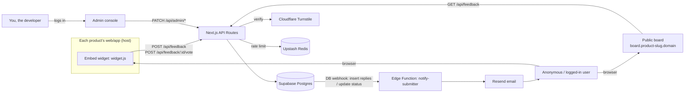
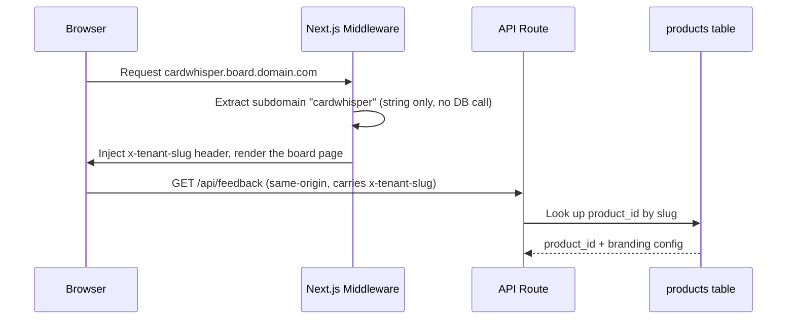
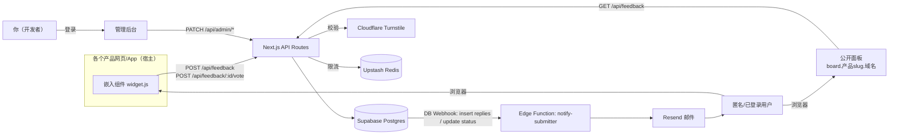
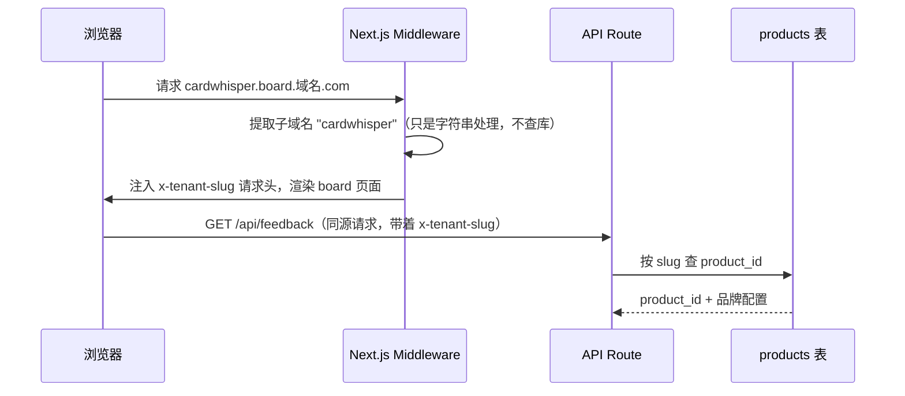

# Architecture

## System context

## Module boundaries (high cohesion, low coupling)

| Module | Responsibility | Explicitly not | Depends on |
|---|---|---|---|
| **widget** (embed component) | Renders the submission form, calls the public API | Never connects to the database directly, has no knowledge the admin console exists | Only `packages/core`'s types/validation schemas |
| **board** (public page) | Shows the feedback list, votes, status, and replies for a tenant | Contains no admin operations (status changes, writing replies) | Depends on `core`, reads/writes through API Routes |
| **admin** (admin console) | Status changes, writing replies, the cross-product unified inbox view | Never sends email directly (see the event-driven design below) | Depends on `core`, requires login |
| **API Routes** | Request validation (including anti-abuse), tenant resolution, database reads/writes | Not responsible for sending email or computing duplicates (dedup is a separate, later-phase module) | Depends on `core`, depends on the Supabase client |
| **notify-submitter** (Edge Function) | Listens for DB events, assembles and sends notification emails | Never called directly by business code — only reacts to a DB webhook | Depends on `core`, depends on Resend |
| **tenant-resolver** (middleware) | Resolves a request's subdomain into a tenant *slug* (a string) and injects it as `x-tenant-slug` | Does no database lookup and no authorization — resolving the slug to an actual `product_id` happens per-request in the API layer (`lib/tenant.ts`), not here, and isn't cached yet (see below) | Shared by board/widget/admin |

**The key decoupling point**: when an admin writes a reply in the console, that's just an insert into the `replies` table. The side effect of "email the user" is triggered by a database change event firing an Edge Function — the business code itself has no idea "sending an email" is even a thing. Benefits:

- Adding "also post to Slack when someone replies" later just means adding another Edge Function that listens to the same event — no change to the reply-writing code
- A bug in the notification logic can't break the core read/write path (they're independent units of execution; one going down doesn't take the other with it)

## Multi-tenant routing design

Borrows Fider's approach: one codebase, subdomain mapped to `product_id`. Split across two layers rather than resolved once — middleware only ever produces a *slug* (a string, no I/O); turning that slug into an actual `product_id` is the API layer's job, on every request:

Local dev and test environments fall back to the `DEFAULT_TENANT_SLUG` env var instead of relying on a real subdomain.

**Caching**: `lib/tenant.ts` keeps successful slug lookups in a per-instance in-memory cache for 60 seconds, so a busy board doesn't re-query `products` on every request. Misses are not cached (a newly registered product shows up immediately); edits to a cached product can take up to a minute to propagate to other instances. A shared cache (e.g. Redis) is only worth adding if real traffic calls for it.

## Cross-product unified inbox

The admin console's default view is "all products" — it aggregates feedback across every `product_id`, with an option to switch to a single-product view. This is the core scenario difference versus Fider/Astuto/Quackback: they assume "one deployment = one product/organization," while this project assumes "one deployment = every product this developer owns." As a result:

- `feedback` queries default to no `product_id` filter — the admin console is the only "god view" entry point
- board/widget must always filter by `product_id` (tenant isolation is mandatory in these two end-user-facing modules, optional in the admin console)

## Key data flows

### Submitting feedback

1. The widget collects the form contents (including the honeypot field) + a Turnstile token
2. The API Route validates the zod schema in `core` first (fields have to be parsed out before there's a honeypot value to check) → if the honeypot is non-empty, silently return a fake success → verify Turnstile → check the Redis rate limit (by IP hash) → resolve the tenant by `productSlug` → insert into `feedback`
3. Returns a result to the widget; no notification fires (there's no one to notify about a brand-new submission)

### Voting

1. The widget/board submits the `productSlug` for the tenant that owns `feedback_id`, plus `voter_email` and a Turnstile token (the bar for voting is lower than submitting feedback, but still needs basic checks against script-driven ballot stuffing)
2. The API Route validates, then double-checks that `feedback_id` actually belongs to the tenant resolved from `productSlug` (preventing cross-tenant vote-by-guessed-id), then inserts into `votes` — the `(feedback_id, voter_email)` unique constraint provides natural deduplication, and a conflict returns "already voted" instead of erroring out

### Admin reply / status change

1. Admin calls `PATCH /api/admin/feedback/:id` (status change) or `POST /api/admin/feedback/:id/reply` (write a reply)
2. The write commits; no email logic is invoked at this step
3. A Supabase DB webhook detects the insert into `replies` or the change to `feedback.status`, and asynchronously invokes the `notify-submitter` Edge Function
4. The Edge Function looks up the submitter's email for that feedback item and calls Resend to send the notification

## Security boundaries

- **RLS (Row Level Security)**: `feedback`/`votes`/`replies` expose only `select` and a restricted `insert` to the anonymous role (it cannot change `status` or insert a reply with `is_admin=true`). Status changes and admin replies can only go through the service-role key (held only by server-side API Routes). The permission boundary lives at the data layer, not just behind a hidden button in the UI.
- **Three-layer anti-abuse**: honeypot field (catches naive scripts) → Turnstile (catches automated tools) → IP rate limiting (catches high-frequency requests that get past the first two). The three layers are independent middleware functions — any one of them can be disabled or swapped out without affecting the other two.
- **`notify-submitter` shared-secret auth**: this Edge Function has Supabase's own JWT verification turned off (the newer `sb_secret_`/`sb_publishable_` key format isn't a legacy-secret-signed JWT, so that check doesn't work here — see the deployment note in API.md), so it checks its own `x-webhook-secret` header against a `WEBHOOK_SECRET` env var instead. Without this, the function's public URL would accept a forged payload from anyone who found it, turning the Resend account into an open relay.

---

# 架构设计（中文）

## 系统上下文

## 模块边界（高内聚低耦合）

| 模块 | 职责 | 不做什么 | 依赖方向 |
|---|---|---|---|
| **widget**（嵌入组件） | 渲染提交表单、调用公开 API | 不直接连数据库，不知道管理后台的存在 | 只依赖 `packages/core` 的类型/校验 schema |
| **board**（公开面板） | 按租户展示反馈列表、投票、状态、回复 | 不包含任何管理态操作（改状态、写回复） | 依赖 `core`，通过 API Routes 读写 |
| **admin**（管理后台） | 改状态、写回复、跨产品统一收件箱视图 | 不直接处理邮件发送（见下方事件驱动设计） | 依赖 `core`，需要登录态 |
| **API Routes** | 请求校验（含防刷）、租户解析、数据库读写 | 不负责邮件发送、不负责判重计算（判重是后续阶段独立模块） | 依赖 `core`，依赖 Supabase client |
| **notify-submitter**（Edge Function） | 监听 DB 事件，组装并发送通知邮件 | 不被业务代码直接调用，只响应 DB Webhook | 依赖 `core`，依赖 Resend |
| **tenant-resolver**（中间件） | 将请求的子域名解析为租户 *slug*（字符串），注入 `x-tenant-slug` | 不查库、不做权限校验——把 slug 解析成真正的 `product_id` 是 API 层（`lib/tenant.ts`）每次请求都要做的事，不在这里，也还没做缓存（见下文） | 被 board/widget/admin 共用 |

**关键解耦点**：管理员在后台写回复，只是往 `replies` 表插入一行数据；"发一封邮件通知用户"这个副作用，是数据库变更事件触发 Edge Function 去做的，业务代码本身完全不知道"发邮件"这件事的存在。好处：

- 以后想加"回复时同步发 Slack 通知"，只需要另加一个监听同一个事件的 Edge Function，不用改动写回复的代码
- 通知逻辑的 bug 不会影响核心的读写操作（两者是独立的执行单元，一个挂了不影响另一个）

## 多租户路由设计

参考 Fider 的思路：一套代码，通过子域名映射到 `product_id`。这一步拆成两层，不是一次性解析完——中间件只产出一个 *slug*（字符串，不做任何 I/O）；把这个 slug 变成真正的 `product_id` 是 API 层每次请求都要做的事：

本地开发和测试环境通过环境变量 `DEFAULT_TENANT_SLUG` 兜底，不依赖真实子域名。

**缓存**：`lib/tenant.ts` 把成功的 slug 查询结果在每个服务实例的内存里缓存 60 秒，繁忙的面板不必每次请求都查一遍 `products`。查不到的结果不缓存（新注册的产品立刻可见）；已缓存产品的修改最多需要一分钟才会传播到其他实例。只有真实流量需要时才值得再加共享缓存（如 Redis）。

## 跨产品统一收件箱

管理后台默认视图是"全部产品"，按 `product_id` 聚合展示所有反馈，可切换到单产品视图。这是与 Fider/Astuto/Quackback 的核心场景差异——它们假设"一个部署=一个产品/一个组织"，本项目假设"一个部署=开发者名下所有产品"，因此：

- `feedback` 查询默认不带 `product_id` 过滤，管理后台是唯一的"上帝视角"入口
- board/widget 必须带 `product_id` 过滤（租户隔离在这两个面向终端用户的模块是强制的，在管理后台是可选的）

## 关键数据流

### 提交反馈

1. widget 收集表单内容（含蜜罐字段）+ Turnstile token
2. API Route 校验 `core` 中的 zod schema（先解出字段才有蜜罐值可查）→ 蜜罐非空则静默假成功返回 → 校验 Turnstile → 检查 Redis 频率限制（按 IP hash）→ 按 `productSlug` 解析租户 → 写入 `feedback` 表
3. 返回结果给 widget，不触发任何通知（首次提交无需通知提交者本人）

### 投票

1. widget/board 提交 `feedback_id` 所属租户的 `productSlug` + `voter_email` + Turnstile token（投票门槛比提交反馈低，但仍需基础校验防止脚本刷票）
2. API Route 校验后，二次核对该 `feedback_id` 确实属于 `productSlug` 解析出的租户（防止跨租户猜测 id 投票），再向 `votes` 表插入一行，利用 `(feedback_id, voter_email)` 唯一约束天然去重，冲突时返回"已投过票"而不是报错中断

### 管理员回复 / 状态变更

1. admin 调用 `PATCH /api/admin/feedback/:id`（改状态）或 `POST /api/admin/feedback/:id/reply`（写回复）
2. 写入成功后事务提交，不在这一步调用任何邮件逻辑
3. Supabase DB Webhook 检测到 `replies` 表 insert 或 `feedback.status` 变更，异步调用 `notify-submitter` Edge Function
4. Edge Function 查出该反馈的提交者邮箱，调用 Resend 发送通知

## 安全边界

- **RLS（Row Level Security）**：`feedback`/`votes`/`replies` 对匿名角色只开放 `select` 和受限的 `insert`（不能改 `status`、不能插入 `is_admin=true` 的回复），改状态和写管理员回复只能通过 service-role 密钥（仅服务端 API Route 持有）执行。权限边界下沉到数据层，而不是只靠前端隐藏按钮。
- **防刷三层**：蜜罐字段（拦截无脑脚本）→ Turnstile（拦截自动化工具）→ IP 频率限制（拦截绕过前两者的高频请求），三层是独立的中间件函数，任意一层都可以单独禁用/替换而不影响另外两层。
- **`notify-submitter` 的共享密钥校验**：这个 Edge Function 关掉了 Supabase 自己的 JWT 校验（新版 `sb_secret_`/`sb_publishable_` 这套密钥不是 legacy secret 签发的 JWT，这个校验在这里本来就通不过，见 API.md 的部署说明），改成自己校验请求头里的 `x-webhook-secret` 是否跟 `WEBHOOK_SECRET` 这个环境变量一致。没有这一步，这个函数的公开 URL 会接受任何人伪造的请求体，把 Resend 账号变成一个垃圾邮件转发器。
