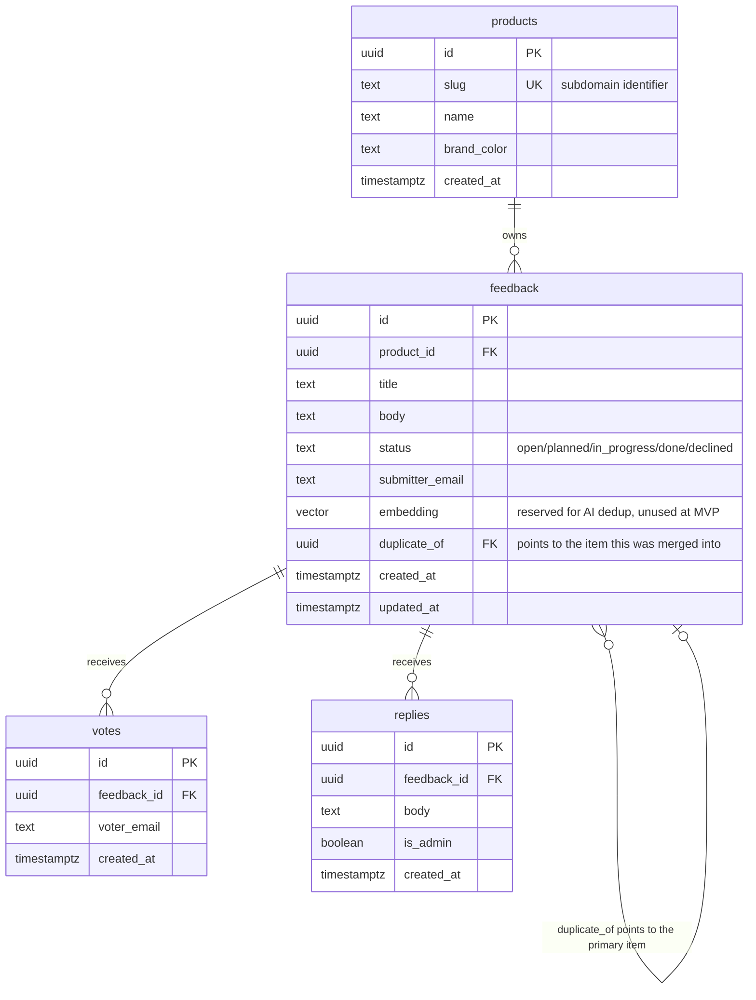
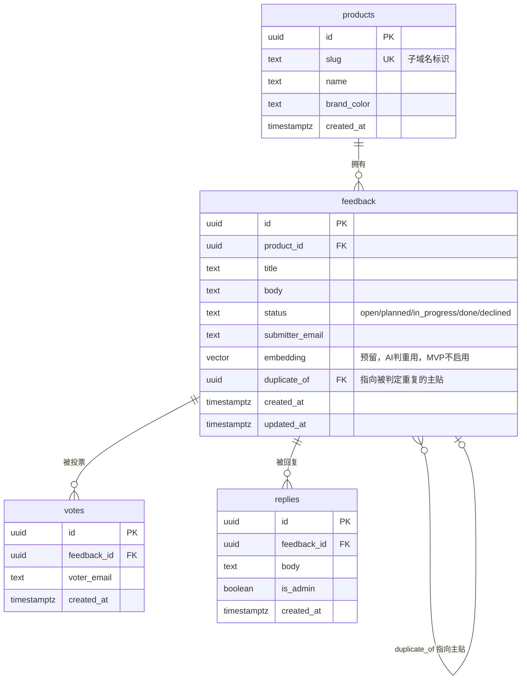

# Data Model

## ER diagram



## DDL

```sql
create extension if not exists "uuid-ossp";
create extension if not exists vector; -- reserved for pgvector, unused at the MVP stage

create table products (
  id uuid primary key default gen_random_uuid(),
  slug text unique not null,          -- used for subdomain/route matching, e.g. 'cardwhisper'
  name text not null,
  brand_color text,
  created_at timestamptz not null default now()
);

create table feedback (
  id uuid primary key default gen_random_uuid(),
  product_id uuid not null references products(id) on delete cascade,
  title text not null,
  body text,
  status text not null default 'open'
    check (status in ('open','planned','in_progress','done','declined')),
  submitter_email text not null,
  embedding vector(1536),             -- enabled in Roadmap Phase 3
  duplicate_of uuid references feedback(id),
  created_at timestamptz not null default now(),
  updated_at timestamptz not null default now()
);

create table votes (
  id uuid primary key default gen_random_uuid(),
  feedback_id uuid not null references feedback(id) on delete cascade,
  voter_email text not null,
  created_at timestamptz not null default now(),
  unique (feedback_id, voter_email)   -- the sole basis for vote deduplication
);

create table replies (
  id uuid primary key default gen_random_uuid(),
  feedback_id uuid not null references feedback(id) on delete cascade,
  body text not null,
  is_admin boolean not null default true,
  created_at timestamptz not null default now()
);

-- indexes
create index idx_feedback_product_status on feedback(product_id, status);
create index idx_votes_feedback on votes(feedback_id);
create index idx_replies_feedback on replies(feedback_id);
```

> Rate limiting doesn't live in a Postgres table — it uses Upstash Redis sliding-window counters (see the anti-abuse design in ARCHITECTURE.md), avoiding the need for an extra data-cleanup job.

## Row Level Security and grants

The `anon` and `authenticated` roles have **no** privileges on `products`, `feedback`, `votes` or `replies`. RLS is enabled on all four tables with no policies, so access is denied by default. The application never queries these tables as `anon`: board, widget and admin requests all go through API Routes that use the service-role key (see ARCHITECTURE.md, "Security boundaries"), and the Supabase browser/server clients are used for admin authentication only.

Earlier migrations (0001/0002) granted `anon` read access and a restricted insert on `feedback` and `votes`. That exposed `submitter_email` / `voter_email` to anyone holding the public anon key, and let direct PostgREST inserts skip Turnstile and rate limiting. Migration `20261009000000_revoke_anon_data_access.sql` removes those policies and grants. See [ADR 0007](decisions/0007-revoke-anon-data-access.md).

```sql
alter table feedback enable row level security;
alter table votes enable row level security;
alter table replies enable row level security;
alter table products enable row level security;
-- no policies: default deny for every role without BYPASSRLS

grant usage on schema public to service_role, anon, authenticated;
grant all on all tables in schema public to service_role;
grant all on all sequences in schema public to service_role;
-- nothing is granted to anon/authenticated on the data tables
```

RLS policies decide *which rows* a role can touch; GRANT decides whether it can touch the table at all. Some Supabase project configurations don't automatically grant `service_role` privileges on newly created tables, which shows up as `permission denied for table X`, so the `service_role` grants stay explicit. The migration also revokes the default `anon`/`authenticated` privileges for future tables in `public`, so a new table is private until a migration deliberately opens it.

Regression test: `npx supabase test db` runs `supabase/tests/database/anon_access.test.sql`.

## Tables and roles added for the MCP server

Added by migrations `20261010000000_mcp_agent_views.sql` and `20261010000100_reply_drafts.sql`; see [MCP.md](MCP.md) and [ADR 0008](decisions/0008-mcp-server-design.md).

| Object | Purpose |
|---|---|
| `reply_drafts` | A reply proposed by an AI assistant: `feedback_id`, `body` (1 to 2000), `rationale` (up to 500), `contains_links`, `source`, `status` (`pending` / `published` / `rejected`), `published_reply_id`, `reviewed_at`. A draft is not a reply: it never reaches `replies` until it is published |
| `mcp.products`, `mcp.feedback`, `mcp.replies` | Views the assistant reads. They expose no email column; `mcp.feedback` adds `submitter_ref` (a salted hash), `vote_count` and `admin_reply_count` |
| `private.mcp_settings` | Holds the salt for `submitter_ref`. The `private` schema is not readable by the assistant's role |
| `mcp_agent` (role) | The role the MCP server connects as: no privileges on `public` tables, `select` on the `mcp` views, `select` and a column-limited `insert` on `reply_drafts` |
| `publish_reply_draft(uuid)`, `reject_reply_draft(uuid)` | `service_role` only. Publishing flips the status and inserts the reply in one transaction and returns null if the draft is not pending |

A `before insert` trigger on `reply_drafts` sets `contains_links` itself and enforces at most 3 pending drafts per feedback item and 50 overall, so the limits hold even if a client is manipulated. Row Level Security on the table has policies only for `mcp_agent`; `anon` and `authenticated` have no access. Tests: `supabase/tests/database/mcp_agent.test.sql`.

## Additional field notes

- `submitter_email` / `voter_email`: there's no account system — the email address is the identity. For a user already logged into the host product, the host page pre-fills the email when it initializes the widget (see the widget init params in API.md); logged-out users type it in manually.
- `embedding`: this column stays empty throughout the MVP. When AI dedup ships in Roadmap Phase 3, a background job backfills historical rows before incremental maintenance begins.
- `duplicate_of`: points to the primary item once a duplicate has been manually confirmed. List queries filter out rows where `duplicate_of is not null` by default, and votes/comments are rolled up into the primary item when displayed.

---

# 数据模型（中文）

## ER 图



## DDL

```sql
create extension if not exists "uuid-ossp";
create extension if not exists vector; -- 预留 pgvector，MVP 阶段不使用

create table products (
  id uuid primary key default gen_random_uuid(),
  slug text unique not null,          -- 子域名/路由匹配用，如 'cardwhisper'
  name text not null,
  brand_color text,
  created_at timestamptz not null default now()
);

create table feedback (
  id uuid primary key default gen_random_uuid(),
  product_id uuid not null references products(id) on delete cascade,
  title text not null,
  body text,
  status text not null default 'open'
    check (status in ('open','planned','in_progress','done','declined')),
  submitter_email text not null,
  embedding vector(1536),             -- Roadmap Phase 3 启用
  duplicate_of uuid references feedback(id),
  created_at timestamptz not null default now(),
  updated_at timestamptz not null default now()
);

create table votes (
  id uuid primary key default gen_random_uuid(),
  feedback_id uuid not null references feedback(id) on delete cascade,
  voter_email text not null,
  created_at timestamptz not null default now(),
  unique (feedback_id, voter_email)   -- 投票去重的唯一依据
);

create table replies (
  id uuid primary key default gen_random_uuid(),
  feedback_id uuid not null references feedback(id) on delete cascade,
  body text not null,
  is_admin boolean not null default true,
  created_at timestamptz not null default now()
);

-- 索引
create index idx_feedback_product_status on feedback(product_id, status);
create index idx_votes_feedback on votes(feedback_id);
create index idx_replies_feedback on replies(feedback_id);
```

> 频率限制不落 Postgres 表，走 Upstash Redis 的滑动窗口计数（见 ARCHITECTURE.md 防刷设计），避免为限流引入额外的数据清理任务。

## 行级安全与权限授予

`anon` 和 `authenticated` 角色对 `products`、`feedback`、`votes`、`replies` **没有任何权限**。四张表都开启了 RLS 且不设任何 policy，默认拒绝。应用从不以 `anon` 身份查询这些表：面板、嵌入组件和管理后台的请求全部经由使用 service-role 密钥的 API Route（见 ARCHITECTURE.md "安全边界"），Supabase 的浏览器端/服务端 client 只用于管理员登录认证。

早期迁移（0001/0002）曾给 `anon` 开放 `feedback`、`votes` 的读取和受限插入。这会让任何持有公开 anon key 的人读到 `submitter_email` / `voter_email`，也能绕过 Turnstile 和限流，直接通过 PostgREST 写入数据。迁移 `20261009000000_revoke_anon_data_access.sql` 移除了这些 policy 和授权，见 [ADR 0007](decisions/0007-revoke-anon-data-access.md)。

```sql
alter table feedback enable row level security;
alter table votes enable row level security;
alter table replies enable row level security;
alter table products enable row level security;
-- 不设任何 policy：没有 BYPASSRLS 的角色一律默认拒绝

grant usage on schema public to service_role, anon, authenticated;
grant all on all tables in schema public to service_role;
grant all on all sequences in schema public to service_role;
-- 不给 anon/authenticated 授予数据表上的任何权限
```

RLS policy 决定"这个角色能碰哪些行"，GRANT 决定"这个角色能不能碰这张表"。有些 Supabase 项目配置下，新建的表不会自动给 `service_role` 授权，症状是报 `permission denied for table X`，所以 `service_role` 的授权保持显式写出。迁移还撤销了 `public` schema 里今后新建表默认授予 `anon`/`authenticated` 的权限，新表在迁移明确开放之前都是私有的。

回归测试：`npx supabase test db` 会运行 `supabase/tests/database/anon_access.test.sql`。

## 为 MCP 服务器新增的表和角色

由迁移 `20261010000000_mcp_agent_views.sql` 和 `20261010000100_reply_drafts.sql` 添加，见 [MCP.md](MCP.md) 和 [ADR 0008](decisions/0008-mcp-server-design.md)。

| 对象 | 作用 |
|---|---|
| `reply_drafts` | AI 助手提议的回复：`feedback_id`、`body`（1 到 2000）、`rationale`（最多 500）、`contains_links`、`source`、`status`（`pending` / `published` / `rejected`）、`published_reply_id`、`reviewed_at`。草稿不是回复：发布之前不会进入 `replies` |
| `mcp.products`、`mcp.feedback`、`mcp.replies` | 助手读取的视图。没有任何邮箱列；`mcp.feedback` 增加了 `submitter_ref`（加盐哈希）、`vote_count` 和 `admin_reply_count` |
| `private.mcp_settings` | 保存 `submitter_ref` 的盐。`private` schema 对助手的角色不可读 |
| `mcp_agent`（角色） | MCP 服务器连接所用的角色：对 `public` 里的表没有任何权限，可 `select` `mcp` 视图，可 `select` 以及按列限制 `insert` `reply_drafts` |
| `publish_reply_draft(uuid)`、`reject_reply_draft(uuid)` | 仅 `service_role`。发布在同一个事务里改状态并插入回复，草稿不是待审状态时返回 null |

`reply_drafts` 上的 `before insert` 触发器会自行设置 `contains_links`，并限制每条反馈最多 3 条待审草稿、全局最多 50 条，所以即使客户端被操纵，这些限制依然成立。该表的 RLS 只有针对 `mcp_agent` 的策略，`anon` 和 `authenticated` 没有任何权限。测试：`supabase/tests/database/mcp_agent.test.sql`。

## 字段说明补充

- `submitter_email` / `voter_email`：不做账号体系，邮箱即身份。已登录宿主产品的用户，由宿主页面在初始化 widget 时预填邮箱（见 API.md 的 widget 初始化参数），未登录用户手动输入。
- `embedding`：MVP 阶段该列始终为空，Roadmap Phase 3 启用 AI 判重时，由后台任务统一回填历史数据后开始增量维护。
- `duplicate_of`：人工确认判重后指向的主贴 id；查询列表时默认过滤掉 `duplicate_of is not null` 的记录，票数/评论在展示时归并到主贴。
